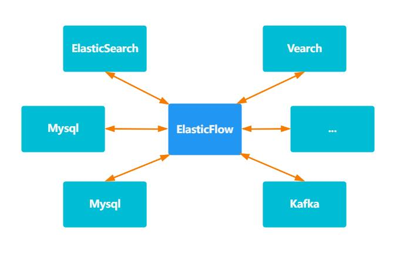
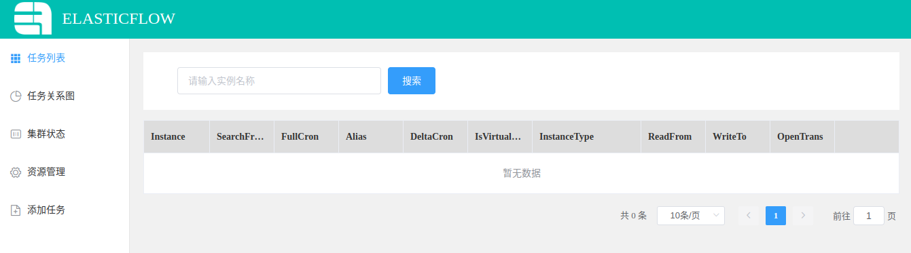

<div align="center">
  
  
  


</div>


# ElasticFlow (伊塔)
ElasticFlow（伊塔）是一个开源弹性流数据交换系统，支持在任意类型数据端之间通过简单配置就可以建立可计算的弹性流管道，并进行定时、定量、高并发、多类型的交换数据服务。系统可应用于数据交换、通用搜索引擎、数据发布服务、数据仓库等项目。

<div align="center">
  
</div>

# ElasticFlow用来解决什么?

- ElasticFlow作为数据交换系统，可以将不同数据源向目标端写入数据，并且还可以支持数据交换过程中的数据计算处理服务。ElasticFlow数据交换过程中有多层级多粒度的控制方式，方便数据的”读端“与”写端“二者进行字段映射工作。除此之外，系统还有一套写端控制机制以支持多任务往同一处写的同步控制机制。
- ElasticFlow可以以分布式系统(Master/Slave)增强其运行性能也可以单节点方式运行，其中分布式部署将支持自动对实例级进行任务负载均衡，以实现大规模的弹性流任务构建。
- 可以解决问题：
    - 不同源之间的数据同步；
    - 对数据进行计算端处理（如接入NLP、CV领域模型进行推理处理）在写入目标端，如视频流业务接入；
    - 构建搜索引擎服务，如增量、全量以及按日期等方式建立索引；
    - 其他系统间需要进行数据交换控制的场景。
    
# Versions
    - version 5.x
    - Java>=11

# 特性
- 支持分布式或者单节点模式运行系统
- 支持分布式任务调度，如系统可自动在集群之间进行任务负载均衡
- 支持多层级并发执行策略，如管道并发、任务并发等多种方式加快数据处理
- 支持任务链式运行，系统提供任务之间的先后顺序依赖运行控制
- 支持任务优先级调度，当资源不足时低优先级任务将自动缩小处理管道
- 支持控制任务的抽象级任务，虚任务可以对多个任务在写端进行同一个事项时的控制
- 支持数据集成与计算，主要是可支持接入外部服务以提供深度学习模型数据推理处理

# 核心优势
- 可靠的数据质量监控
    - 每一个字段可以配置自己的数据类型转换策略，让数据可以完整无损的传输到目的端；
    - 提供作业读、计算、写三端的实时运行时监控；
- 弹性流控制
    - 任务运行时监测任务运行状态，当状态错误达到指定特征值，将断开流；
    - 任务运行带有优先级控制，当系统资源缺乏时将动对低优先级别运行“流量”进行控制，自动缩小管道大小；
- 数据计算控制
    - 引入了计算端后，系统可以对流数据进行计算服务，可以通过Rest API或者加载深度学习模型的方式提供推理计算服务；
    - 计算端可以按流大小自动控制系统的启动更多计算服务，并进行负载均衡管理；
- 强劲的同步性能
    - 数据处理可以在管道、channel等多个级别上进行并发处理；
    - 系统支持虚任务，可以使用多个任务来完成同一个数据处理，由虚任务来实现多个任务间控制；
- 健壮的容错机制
    - 系统可以自动实现线程级别、进程级别、作业级别多层次局部/全局的重试，保证任务的稳定运行；
    - 系统关闭使用软关闭模式，会自动进行集群任务安全着落，防止脏数据进入末端和读端的数据丢失。

# Reader Support
    - Hbase     1.x
    - Kafka     
    - RocketMQ  4.x
    - Mysql
    - Oracle
    - files (txt,csv)

# Computer Support
    - Rest API (POST/JSON)
    - Model
    
# Writer Support
    - ElasticSearch 7.x
    - Mysql
    - Neo4j 3.x
    - Vearch
    - Hbase 1.x
    - Kafka 2.x
    
# Searcher Support
    - Vearch
    - Kafka
    - ElasticSearch
    
# Document
- [详细文档参照wiki](https://github.com/springwings/elasticflow/wiki)  
- [数据交换范例参考](./example)  
- [安装部署参考](https://github.com/springwings/elasticflow/wiki/v5.x-%E9%83%A8%E7%BD%B2%E8%BF%90%E8%A1%8C) 

# 可视化管理界面
- http://ip:8616
<div align="center">
  
</div>


# Changes
5.0 版本对之前版本在架构上全新升级，不再通过Java原生支持深度学习，计算流通过调用外部推断服务rest接口实现数据计算服务。

# EF 插件开发
   1. pom入包：
   ```xml
      <dependency>
        <groupId>org.elasticflow</groupId>
        <artifactId>elasticflow</artifactId>
        <version>5.8.2</version>
      </dependency>
   ```
   2. plugin开发测试代码，例如：
   ```java
        @Before
        public void setUp() {
            System.setProperty("config", "file:/work/EF/config");
            System.setProperty("nodeid", "1");
        }
        
        @Test
        public void testPlugin() throws Exception {
            Run.main(null);
            while(true) {
        
            }
        }
   ```
       

# 开发计划
1. 支持LLMs 更多能力接入
2. 优化调用链监控。
3. 6.x版本功能规划。

## Citing ElasticFlow (伊塔)

```bibtex
@article{agtabular,
  title={ElasticFlow (伊塔):ElasticFlow（伊塔）是一个开源弹性流数据交换系统，支持在任意类型数据端之间通过简单配置就可以建立可计算的弹性流管道，并进行定时、定量、高并发、多类型的交换数据服务。系统可应用于数据交换、通用搜索引擎、数据发布服务、数据仓库等项目。},
  author={chengwen}, 
  year={2023}
}
``` 